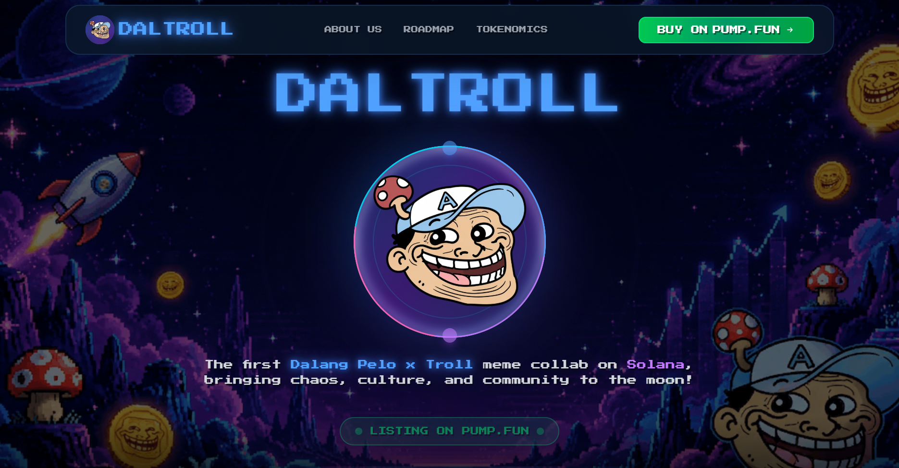

# DALTROLL Meme Coin Landing Page

> The first Dalang Pelo x Troll meme collab on Solana, bringing chaos, culture, and community to the moon! 🚀


## Preview




## Features

- **Next.js 16** with App Router & Turbopack
- **Tailwind CSS 4** for modern styling
- **Custom Pixel Font** (Press Start 2P)
- **Vector Icons** - Custom SVG icons (no emoji dependencies)
- **Fully Responsive** - Mobile-first design
- **Animated Background** - GIF background with decorative elements
- **Smooth Animations** - Float, pulse, shine effects
- **Active Section Detection** - Smart navbar highlighting
- **Performance Optimized** - Static generation, image optimization

## Sections

1. **Hero** - Main landing with logo and CTA buttons
2. **About Us** - Project story and mission
3. **Roadmap** - 4-phase development plan
4. **Tokenomics** - Token distribution and features
5. **Footer** - Links and information

## Quick Start

### Prerequisites

- Node.js 20+ 
- npm or yarn

### Installation

```bash
# Clone the repository
git clone https://github.com/xvrique/daltroll-meme.git
cd daltroll-meme

# Install dependencies
npm install

# Run development server
npm run dev
```

Open [http://localhost:3000](http://localhost:3000) in your browser.

## Build & Deploy

### Build for Production

```bash
npm run build
npm start
```

### Deploy Options

#### Vercel (Recommended)
```bash
npm install -g vercel
vercel
```

#### Netlify
```bash
npm install -g netlify-cli
netlify deploy --prod
```

#### Docker
```bash
docker build -t daltroll-landing .
docker run -p 3000:3000 daltroll-landing
```

See [DEPLOYMENT.md](DEPLOYMENT.md) for detailed deployment instructions.

## 🎨 Customization

### Colors
Edit colors in `app/globals.css`:
```css
:root {
  --background: #0a1628;
  --foreground: #ffffff;
}
```

### Content
- **Hero**: `components/Hero.tsx`
- **About**: `components/AboutUs.tsx`
- **Roadmap**: `components/Roadmap.tsx`
- **Tokenomics**: `components/Tokenomics.tsx`

### Assets
Place your assets in `public/assets/`:
- `logo-main.png` - Main logo
- `background.gif` - Animated background
- Other decorative images

See [SETUP-ASSETS.md](SETUP-ASSETS.md) for asset requirements.

## Vector Icons

Custom SVG icons located in `components/icons/Icons.tsx`:
- RocketIcon, CommunityIcon, TheaterIcon
- DiamondIcon, FireIcon, ShieldIcon
- And 12 more...

See [VECTOR-ICONS-UPDATE.md](VECTOR-ICONS-UPDATE.md) for icon documentation.

## Mobile Responsive

Optimized breakpoints:
- **Mobile**: < 768px
- **Tablet**: 768px - 1024px
- **Desktop**: > 1024px

## Tech Stack

- **Framework**: Next.js 16.2 (App Router)
- **Language**: TypeScript 5.0
- **Styling**: Tailwind CSS 4.0
- **Font**: Press Start 2P (Google Fonts)
- **Icons**: Custom SVG components
- **Deployment**: Vercel-ready

## Project Structure

```
stonks-landing/
├── app/
│   ├── layout.tsx          # Root layout
│   ├── page.tsx            # Home page
│   └── globals.css         # Global styles
├── components/
│   ├── Hero.tsx            # Hero section
│   ├── AboutUs.tsx         # About section
│   ├── Roadmap.tsx         # Roadmap section
│   ├── Tokenomics.tsx      # Tokenomics section
│   ├── Navbar.tsx          # Navigation bar
│   ├── Footer.tsx          # Footer
│   └── icons/
│       └── Icons.tsx       # Vector icons
├── public/
│   └── assets/             # Images and assets
└── README.md
```

## Performance

- Static Site Generation (SSG)
- Image Optimization (Next.js Image)
- Font Optimization (Google Fonts)
- CSS Optimization (Tailwind CSS)
- Code Splitting (Automatic)

## Environment Variables

Create `.env.local` (optional):

```env
NEXT_PUBLIC_TWITTER_URL=https://twitter.com/daltroll
NEXT_PUBLIC_TELEGRAM_URL=https://t.me/daltroll
NEXT_PUBLIC_CONTRACT_ADDRESS=your_solana_contract_address
```

## Contributing

Contributions are welcome! Please feel free to submit a Pull Request.

## License

MIT License - feel free to use this project for your own purposes.

## Links

- **GitHub**: [xvrique/daltroll-meme](https://github.com/xvrique/daltroll-meme)
- **Live Demo**: Coming soon...

## 📧 Contact

- **Email**: hurtcomfort19@gmail.com
- **GitHub**: [@xvrique](https://github.com/xvrique)

---

Made by the DALTROLL community

**Disclaimer**: DALTROLL is a meme coin created for entertainment purposes. Always DYOR (Do Your Own Research) and invest responsibly. Cryptocurrency investments carry risk.
